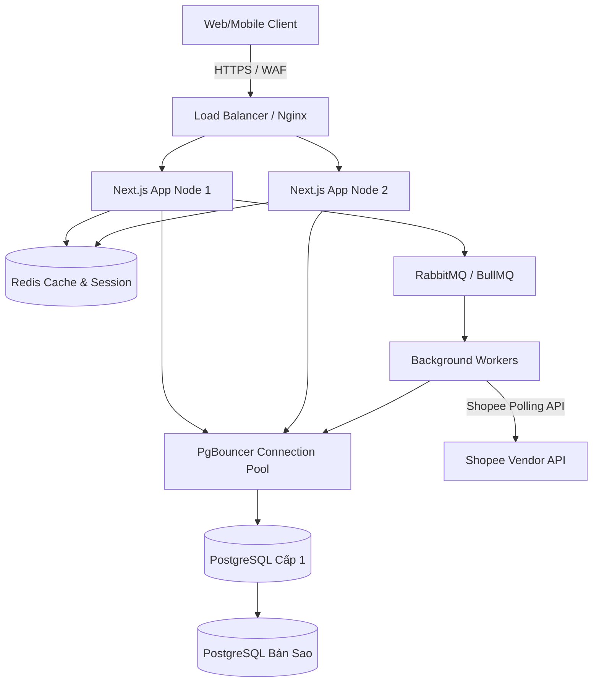
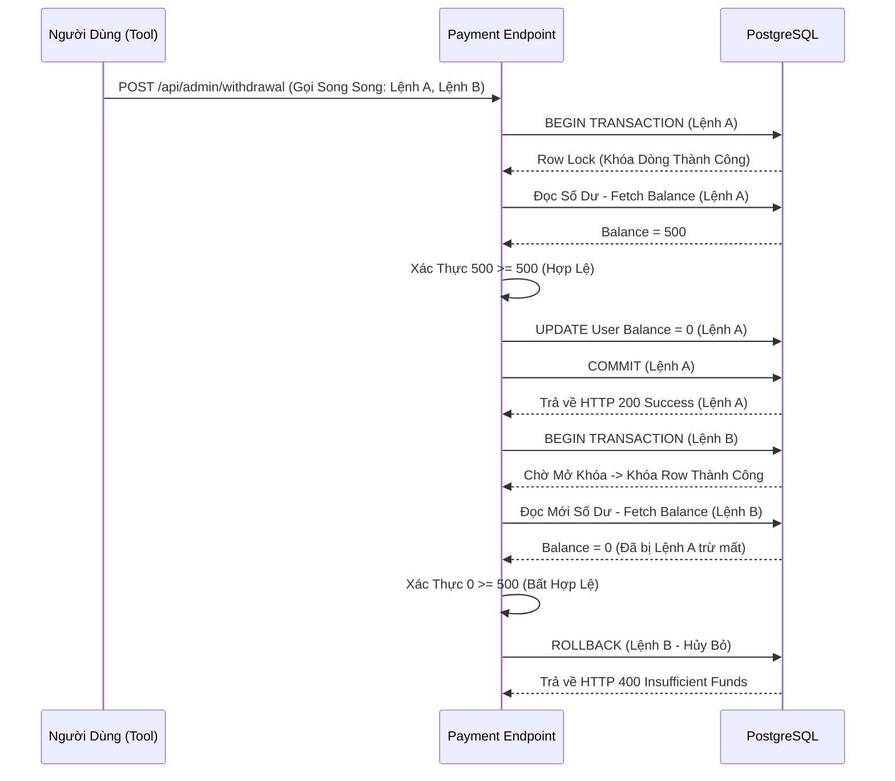

# DATDON - TÀI LIỆU KIẾN TRÚC & THIẾT KẾ HỆ THỐNG DOANH NGHIỆP

Tài liệu này phác thảo kiến trúc hệ thống, các mô hình bảo mật và chỉ dẫn vận hành cho nền tảng DatDon (xử lý đơn hàng Shopee Dropshipping và đối soát tài chính). Được thiết kế nhằm đáp ứng các tiêu chuẩn doanh nghiệp khắt khe cho hệ thống tần suất cao (High-Frequency) và đảm bảo tính toàn vẹn tài chính.

## 1. Kiến Trúc Tổng Thể (System Architecture)

Hệ thống hiện tại được thiết kế theo mô hình **Modular Monolith** sử dụng Next.js (App Router), tối ưu hóa đột phá cho khả năng Server-Side Rendering (SSR) độ trễ thấp và thực thi API tốc độ cao.

### Chiến Lược Mở Rộng & Hàng Đợi Phân Tán (Scaling & Queueing)
Để đáp ứng khối lượng giao dịch tần suất siêu cao, kiến trúc hiện tại đóng vai trò là nền móng cho giai đoạn triển khai phân tán như sau:
* **Stateless Application Nodes (Node Phi Trạng Thái):** Các máy chủ Next.js được thiết kế để scale ngang (horizontal scaling) thông qua chế độ Cluster của PM2 hoặc Kubernetes HPA.
* **Vertical Scaling CSDL & Connection Pooling:** Xử lý nghẽn thắt nút cổ chai kết nối Database bằng PgBouncer hoặc Prisma Accelerate.
* **Message Queue (Mục Tiêu Tương Lai):** Các tiến trình ngầm như đồng bộ trạng thái Shopee (Polling) và dọn rác (Sweeper) sẽ được gỡ khỏi Cronjob nội bộ để chuyển sang kiến trúc hàng đợi phân tán **Redis/BullMQ** hoặc **RabbitMQ**. Việc này loại bỏ xung đột Worker trong môi trường Multi-node và đảm bảo tính bền vững của Message.

### Sơ Đồ Kiến Trúc Quy Mô Mở Rộng


## 2. Cam Kết Chất Lượng Dịch Vụ (SLA / SLO)
* **Tính Sẵn Sàng (Availability):** Mục tiêu SLO đạt 99.9% Uptime, sử dụng Load Balancing của Nginx tích hợp cơ chế tự động phục hồi Node lỗi từ PM2.
* **Độ Trễ Phản Hồi (Latency Metrics):** 
  - Bách phân vị 95 (p95) < 200ms cho các thao tác Đọc (Read / GET).
  - Bách phân vị 95 (p95) < 500ms cho các Giao dịch Ghi khép kín (Write / Txn).
* **Tính Bền Vững Của Dữ Liệu:** Đảm bảo chuẩn ACID 100% cho Sổ Cái Kế Toán (Ledger). "Zero Tolerance" (Tuyệt đối không nhân nhượng) đối với các lỗi Chi tiêu kép (Double-spend) hoặc thất thoát dữ liệu.

## 3. Lõi Tài Chính & Kiểm Soát Concurrency

DatDon áp dụng quy chuẩn Sổ Nhập Kép (Double-Entry Ledger) để quản trị dòng tiền, được chống lưng bởi hệ thống kiểm soát đồng thời (Concurrency Control) cấp độ Database.

### Chống Lỗi Race Condition (Cạnh Tranh Giành Ghi)
Để giải quyết các yêu cầu biến đổi số dư hàng loạt và có tính song song (ví dụ: Admin nháy nút duyệt Crypto Deposit 10 lần trong 1 giây), hệ thống ứng dụng **Interactive Transactions** đi kèm cơ chế Khóa Row-Level (`SELECT ... FOR UPDATE` ẩn đằng sau lăng kính của `prisma.$transaction`).



## 4. Bảo Mật & Tính Lũy Đẳng (Idempotency)

### Lưu Trữ Khóa Lũy Đẳng (Idempotency Persistence)
Các truy vấn API tài chính yêu cầu đính kèm Header `X-Idempotency-Key` nhằm ngăn chặn các tấn công phát lại (Replay Attacks) do Click đúp hoặc Network Loop.
* **Hiện tại (Transition State):** Tạm thời sử dụng `Map` trên RAM hệ thống (In-memory cache) làm cỗ máy xác thực.
* **Nâng cấp Doanh Nghiệp (Target Enterprise Fix):** Để giải quyết rủi ro mất Key Idempotency khi Server dính chu kỳ Restart (dẫn tới việc lộ hổng cho Hacker tái sử dụng mã Key cũ và ăn gian tiền), cấu trúc xác thực này định hướng phải chuyển giao Caching cho **Redis** (Qua lệnh Set khóa `SET key value NX EX 86400`) hoặc chuyển đổi thành biến Persistent lưu cứng tại PostgreSQL.

### Cơ Chế Hạn Chế Lưu Lượng (Rate Limiting)
Các luồng xác thực nhạy cảm (như Xác thực 2FA OTP, Khởi Tạo Lệnh Top-up) áp đặt cơ chế Rate Limit khắt khe tại Application Layer. Trong cấu hình Clustering tương lai, nhiệm vụ này sẽ được chia sẻ lên WAF Cloudflare hoặc Redis Cluster.

## 5. Giám Sát Chi Tiết & Khả Năng Quan Sát (Observability)

Hướng tới chuẩn mực minh bạch của ngành FinTech, hệ thống yêu cầu tích hợp tầng quan sát tổng thể sau:
* **Hệ Thống Logging phân tích log lỗi:** Yêu cầu cài đặt **ELK Stack (Elasticsearch, Logstash, Kibana)** hoặc Datadog. Các tệp tin log vụn (như rà soát `reconciliation_reports.log`) không nên bị giữ tại Local Storage mà phải đẩy qua định dạng đường ống JSON sang Logstash.
* **Chỉ Báo Hệ Thống (Metrics):** Cài đặt **Prometheus** để cào (scrape) các thông số: Bộ nhớ, Nhịp độ CPU, Gánh nặng vòng lặp Event Loop, đi kèm tần suất Active Connections của Prisma.
* **Báo Động Nóng (Alerting):** Cấu hình Grafana tích hợp PagerDuty Slack/Telegram Bot. Cảnh báo khẩn cấp khi: Mật độ lỗi `429 Too Many Requests` tăng đột biến, hoặc Cỗ Máy Reconciliation Engine bắt được lỗi thâm hụt Nợ-Có trong Database.

## 6. Chiến Lược Cache UX Tại Frontend

Giao diện kiến tạo trải nghiệm độ trễ xấp xỉ vô cực (Zero-latency render) được xây dựng trên sự chuyển dịch mạch lạc.
* **Chiến Lược Caching:** Next.js App Router nén ép Cache tĩnh các luồng dữ liệu ít thay đổi. API sẽ tận dụng `revalidatePath` hoặc `revalidateTag` để dọn dẹp Cache ngay tại giây phút thực hiện Mutation (cộng trừ tiền). Loại bỏ hành vi Polling kéo Client ì ạch.
* **Che giấu Độ Trễ (Latency Management):** Các nút Submit, Modal Nạp Tiền ứng dụng Optimistic UI và Loading Suspense Boundaries, triệt tiêu cảm giác đứng máy từ người dùng.
* **Rendering (UI Responsiveness):** Tính toán logic khối nặng (VD: Chắt xuất hàng nghìn hàng Giao dịch) được giữ trọn tại Server Components, giải phóng Main-thread cho Trình duyệt thiết bị di động.

## 7. Khởi Tạo Môi Trường Cục Bộ

### Tải Các Gói Bụ Liệu Cần Thiết
```bash
npm install
```

### Khởi Động Base Database
Khởi tạo cấu trúc bảng và Bơm dữ liệu chuẩn cho các Sổ Tài Khoản trung tâm:
```bash
npx prisma db push
tsx prisma/seed.ts 
npx prisma generate
```

### Chạy Môi Trường
```bash
npm run dev     # Môi trường Development (Live-reload)
npm run build   # Đóng gói tối ưu Production với Turbopack
npm start       # Chạy Production
```
